# Nexora

Nexora هو تطبيق Flutter مبني فوق Firebase يهدف إلى تحويل إدارة العمل اليومي من قوائم مهام تقليدية إلى منصة تعاون فريق حقيقية. النسخة الحالية تعمل وفق فلسفة MVP عملي وقابل للتوسع، مع تركيز واضح على:

- إدارة مساحات العمل والعضويات.
- إدارة المشاريع والمهام.
- نظام انضمام آمن نسبيًا على Firebase Spark بدون Cloud Functions.
- إشعارات داخلية مرتبطة بالأحداث.
- شات سياقي داخل المهمة وشات جماعي داخل مساحة العمل.

> هذا الملف هو التوثيق الهندسي الرئيسي للمشروع.  
> لشرح سيناريوهات العمل حسب كل نوع مستخدم راجع [README_WORKFLOW_AR.md](./README_WORKFLOW_AR.md).

---

## 1. الملخص التنفيذي

### ما الذي يقدمه Nexora؟

Nexora يربط بين أربعة محاور تشغيلية داخل تجربة واحدة:

1. **الهوية والوصول**: تسجيل الدخول وإنشاء ملف المستخدم.
2. **الهيكل التنظيمي**: Workspaces ثم Projects ثم Tasks.
3. **التعاون اليومي**: التعليقات، الشات، والـ mentions.
4. **الحوكمة والمتابعة**: طلبات الانضمام، الموافقات، والإشعارات.

### الفكرة التشغيلية

بدل أن يكون التطبيق مجرد أداة لإنشاء مهمة وتغيير حالتها، تم تصميمه ليصبح طبقة عمل مشتركة بين أعضاء الفريق:

- كل فريق يعمل داخل **Workspace**.
- كل Workspace يحتوي على **Projects**.
- كل Project يحتوي على **Tasks**.
- كل Task يمكن أن يحتوي على **Chat** خاص بالنقاش التنفيذي حول المهمة.
- كل Workspace يحتوي أيضًا على **Workspace Chat** للمحادثات العامة.
- الانضمام إلى الفريق يتم عبر **Join Code + QR + Join Request + Admin Approval**.

---

## 2. النطاق الحالي للمشروع

### داخل النطاق الحالي

- تسجيل مستخدم جديد عبر Firebase Auth.
- تسجيل الدخول بالبريد الإلكتروني وكلمة المرور.
- إنشاء ملف مستخدم في Firestore.
- إنشاء مساحة عمل وإدارتها.
- عرض المساحات التي ينتمي إليها المستخدم.
- إنشاء مشروع داخل مساحة العمل.
- إنشاء المهام وتحديثها وإسنادها.
- تعليقات على المهام.
- شات داخل المهمة.
- شات جماعي داخل مساحة العمل.
- نظام منشن `@` داخل الشات.
- إشعارات داخلية مرتبطة بالمهام والانضمام والشات.
- انضمام عبر كود أو QR مع مراجعة إدارية.
- قواعد Firestore أمنية على مستوى العضوية والدور.

### خارج النطاق الحالي

- Direct Messages بين المستخدمين.
- مكالمات صوتية أو فيديو.
- رفع ملفات أو صور داخل الشات.
- Reactions على الرسائل.
- Typing Indicator حي.
- Read Receipts متقدمة.
- مزامنة خلفية عبر Cloud Functions.

---

## 3. التقنيات المستخدمة

| الطبقة | التقنية | الاستخدام |
|---|---|---|
| واجهة التطبيق | Flutter | بناء واجهات Android / iOS / Web / Desktop من قاعدة كود واحدة |
| اللغة | Dart | منطق التطبيق والواجهات |
| المصادقة | Firebase Auth | تسجيل الدخول وإنشاء الحساب |
| قاعدة البيانات | Cloud Firestore | تخزين جميع البيانات بشكل real-time |
| التخزين | Firebase Storage | مهيأ للمستقبل، غير مستخدم بشكل جوهري في MVP الحالي |
| مشاركة الروابط/البيانات | `share_plus` | مشاركة بعض المحتويات من التطبيق |
| QR | `mobile_scanner`, `qr_flutter` | توليد QR ومسحه للانضمام |
| تخزين محلي بسيط | `shared_preferences` | تفضيلات وبيانات خفيفة |
| الترجمة | `flutter_localizations` + localizations داخلية | دعم العربية والإنجليزية |

### الحزم الأساسية من `pubspec.yaml`

- `firebase_core`
- `firebase_auth`
- `cloud_firestore`
- `firebase_storage`
- `mobile_scanner`
- `qr_flutter`
- `shared_preferences`
- `share_plus`

---

## 4. المبادئ المعمارية

المشروع يتبع نمطًا نظيفًا نسبيًا على مستوى الـ features، مع فصل واضح بين:

- `data`
- `domain`
- `application`
- `presentation`

كما يوجد `AppServices` كحاوية ربط خفيفة للتبعيات حتى يتم الانتقال لاحقًا إلى Dependency Injection أكثر تفصيلًا.

### مبادئ التصميم الحالية

| المبدأ | كيف يظهر في المشروع |
|---|---|
| فصل المسؤوليات | كل Feature تملك طبقاتها الخاصة |
| المصدر الحقيقي للبيانات | Firestore هو الـ source of truth |
| أمان على مستوى البيانات | معظم القيود المهمة موجودة في `firestore.rules` |
| واقعية MVP | تم اختيار حلول تعمل على Spark بدون وظائف سحابية |
| قابلية التوسع | تم فصل entities, repositories, services, widgets لتسهيل التوسع لاحقًا |

### مخطط النظام العام

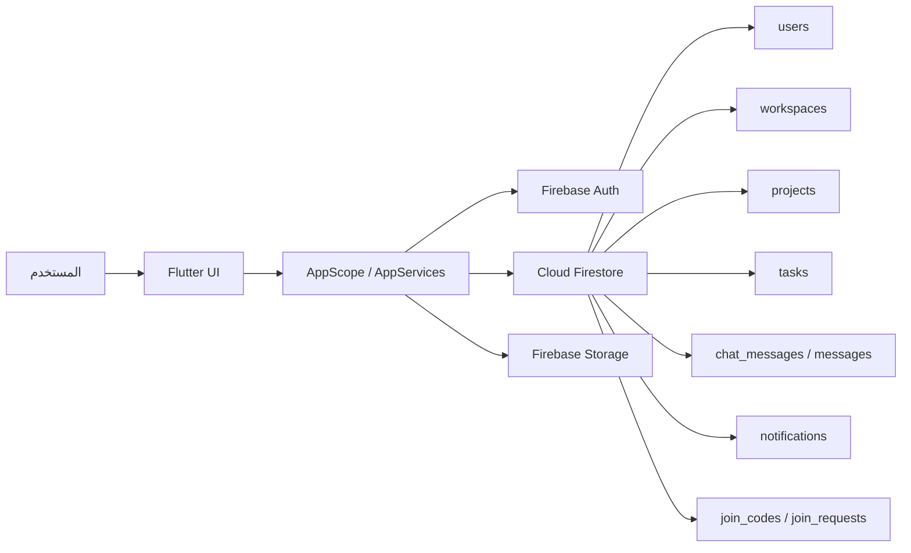

### مخطط الطبقات الداخلية

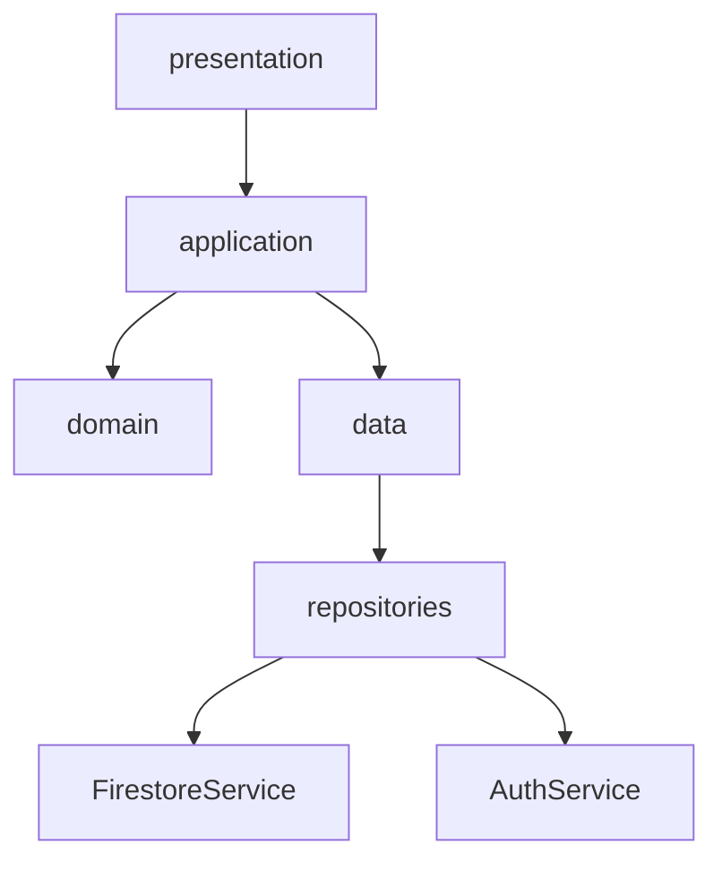

### مخطط الاعتمادات الرئيسة

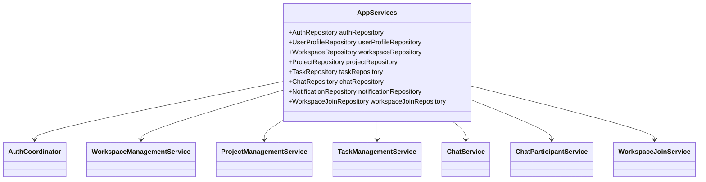

### Data Flow Diagram (DFD)

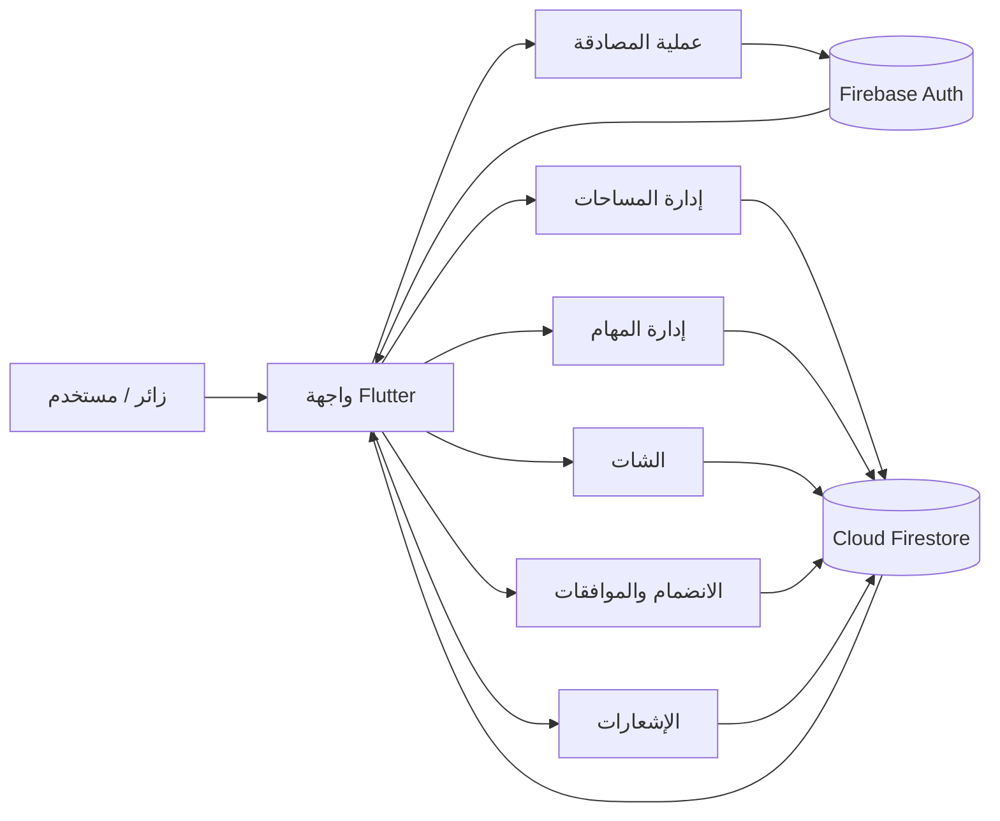

### Use Case Diagram

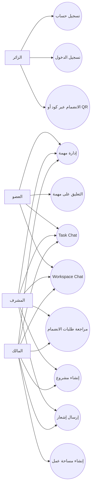

### Activity Diagram

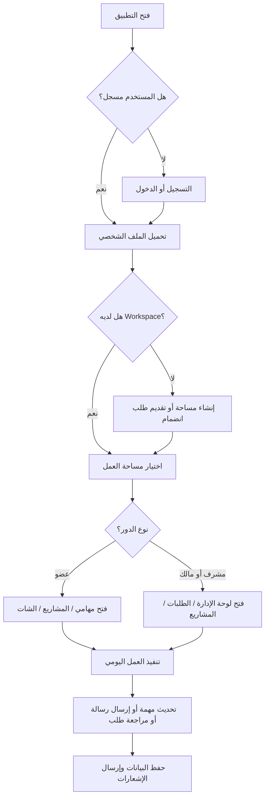

---

## 5. شجرة المشروع

```text
lib/
  app/
    app.dart
    app_scope.dart
    pages/
      app_shell_page.dart
      home_page.dart
  core/
    config/
    constants/
    errors/
    localization/
    services/
    theme/
    validators/
    widgets/
  features/
    auth/
      application/
      data/
      domain/
      presentation/
    chat/
      application/
      data/
      domain/
      presentation/
    home/
      presentation/
    notifications/
      data/
      domain/
      presentation/
    projects/
      application/
      data/
      domain/
      presentation/
    tasks/
      application/
      data/
      domain/
      presentation/
    users/
      data/
      domain/
      presentation/
    workspaces/
      application/
      data/
      domain/
      presentation/
    workspace_join/
      application/
      data/
      domain/
      presentation/
  shared/
```

### ملخص الوحدات الوظيفية

| Feature | المسؤولية |
|---|---|
| `auth` | تسجيل الدخول، التسجيل، ضمان وجود Profile |
| `users` | ملف المستخدم وبياناته الأساسية |
| `workspaces` | إدارة مساحة العمل والأعضاء |
| `workspace_join` | الانضمام عبر كود/QR وطلبات الموافقة |
| `projects` | إدارة المشاريع داخل المساحة |
| `tasks` | إدارة المهام، الحالات، التعليقات |
| `chat` | شات المهمة وشات مساحة العمل |
| `notifications` | إشعارات داخلية على مستوى المستخدم |
| `home` | تجربة التصفح الرئيسية للعضو أو المسؤول |

---

## 6. الأدوار والصلاحيات

يوجد مستويان مختلفان من "الدور":

1. **دور المستخدم العام** داخل `users/{uid}`:
   - `admin`
   - `member`

2. **دور العضوية داخل الـ workspace**:
   - `owner`
   - `admin`
   - `member`

> الدور الفعلي الأكثر تأثيرًا في أغلب الشاشات هو **دور العضوية داخل مساحة العمل**.

### مصفوفة الصلاحيات العملية

| الوظيفة | owner | admin | member |
|---|---|---|---|
| قراءة بيانات الـ workspace | نعم | نعم | نعم |
| تحديث بيانات الـ workspace | نعم | نعم | لا |
| مراجعة طلبات الانضمام | نعم | نعم | لا |
| إنشاء/تعطيل أكواد الانضمام | نعم | نعم | لا |
| قراءة المشاريع والمهام | نعم | نعم | نعم |
| إنشاء/تحديث المهام | نعم | نعم | نعم |
| استخدام Task Chat | نعم | نعم | نعم |
| استخدام Workspace Chat | نعم | نعم | نعم |
| حذف أي رسالة في الشات | نعم | نعم | لا |
| حذف رسالته الشخصية | نعم | نعم | نعم |

---

## 7. نموذج المجال Domain Model

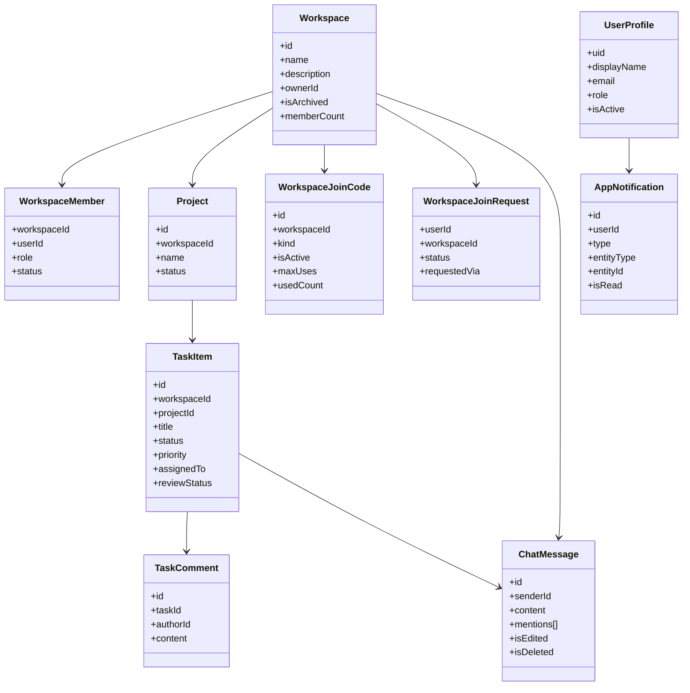

---

## 8. نموذج البيانات في Firestore

### ملاحظة مهمة عن Task Chat

رغم أن الرغبة التشغيلية يمكن التعبير عنها منطقيًا بالشكل:

`workspaces/{workspaceId}/tasks/{taskId}/messages/{messageId}`

إلا أن **التنفيذ الفعلي الحالي** مربوط بمسار المهمة الحقيقي داخل المشروع:

`workspaces/{workspaceId}/projects/{projectId}/tasks/{taskId}/messages/{messageId}`

وهذا قرار صحيح معماريًا في الحالة الحالية لأنه:

- يتجنب نسخ المهمة في مكانين.
- يبقي الشات ملازمًا فعليًا لوثيقة المهمة الأصلية.
- يسهل تطبيق الصلاحيات على نفس الهيكل القائم.

### خريطة العلاقات بين المجموعات

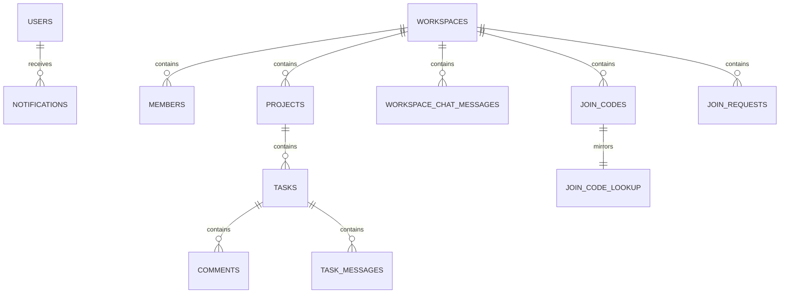

### المسارات الأساسية

| المسار | الوصف |
|---|---|
| `users/{uid}` | ملف المستخدم |
| `users/{uid}/notifications/{notificationId}` | إشعارات المستخدم |
| `workspaces/{workspaceId}` | بيانات مساحة العمل |
| `workspaces/{workspaceId}/members/{userId}` | عضوية المستخدم داخل مساحة العمل |
| `workspaces/{workspaceId}/join_codes/{joinCodeId}` | أكواد الانضمام |
| `workspaces/{workspaceId}/join_requests/{userId}` | طلب الانضمام |
| `join_code_lookup/{codeNormalized}` | lookup مباشر لكود الانضمام |
| `workspaces/{workspaceId}/projects/{projectId}` | المشروع |
| `workspaces/{workspaceId}/projects/{projectId}/tasks/{taskId}` | المهمة |
| `workspaces/{workspaceId}/projects/{projectId}/tasks/{taskId}/comments/{commentId}` | تعليقات المهمة |
| `workspaces/{workspaceId}/projects/{projectId}/tasks/{taskId}/messages/{messageId}` | شات المهمة |
| `workspaces/{workspaceId}/chat_messages/{messageId}` | شات مساحة العمل |

### 8.1 جدول `users/{uid}`

| الحقل | النوع | الوصف | ملاحظات |
|---|---|---|---|
| `uid` | `string` | معرف المستخدم | يساوي UID الخاص بـ Firebase Auth |
| `display_name` | `string` | الاسم الظاهر | يستخدم في الواجهات والشات |
| `email` | `string` | البريد الإلكتروني | يأتي من Auth |
| `role` | `string` | الدور العام | `admin` أو `member` |
| `created_at` | `timestamp` | وقت الإنشاء | اختياري حسب مرحلة الإنشاء |
| `updated_at` | `timestamp` | آخر تحديث | اختياري |
| `is_active` | `bool` | حالة التفعيل | يستخدم للتحقق قبل بعض الإجراءات |

### 8.2 جدول `users/{uid}/notifications/{notificationId}`

| الحقل | النوع | الوصف | القيم المهمة |
|---|---|---|---|
| `id` | `string` | معرف الإشعار | عادة يطابق doc id |
| `user_id` | `string` | صاحب الإشعار | يجب أن يطابق uid للمسار |
| `type` | `string` | نوع الإشعار | مثل `task_assigned`, `chat_mention` |
| `title` | `string` | العنوان | نص مختصر |
| `body` | `string` | الوصف | نص تنبيهي |
| `entity_type` | `string` | نوع الكيان المرتبط | `workspace`, `project`, `task` |
| `entity_id` | `string` | معرف الكيان | مثل taskId |
| `is_read` | `bool` | هل تم القراءة | true / false |
| `created_at` | `timestamp` | وقت الإنشاء | مهم للترتيب |

### 8.3 جدول `workspaces/{workspaceId}`

| الحقل | النوع | الوصف | ملاحظات |
|---|---|---|---|
| `id` | `string` | معرف مساحة العمل | غالبًا مطابق للـ doc id |
| `name` | `string` | اسم مساحة العمل | يظهر في الواجهة |
| `description` | `string` | وصف المساحة | موجز الفريق أو السياق |
| `owner_id` | `string` | مالك المساحة | أقوى صلاحية |
| `created_at` | `timestamp` | وقت الإنشاء | |
| `updated_at` | `timestamp` | آخر تحديث | |
| `is_archived` | `bool` | حالة الأرشفة | عند الأرشفة تصبح الكتابة مقيدة |
| `member_ids` | `array<string>` | قائمة أعضاء المساحة | تستخدم للاستعلامات السريعة |
| `member_count` | `number` | عدد الأعضاء | قيمة denormalized |

### 8.4 جدول `workspaces/{workspaceId}/members/{userId}`

| الحقل | النوع | الوصف | القيم المهمة |
|---|---|---|---|
| `workspace_id` | `string` | معرف المساحة | |
| `user_id` | `string` | معرف العضو | |
| `role` | `string` | دور العضوية | `owner`, `admin`, `member` |
| `status` | `string` | حالة العضوية | `active`, `invited`, `removed` |
| `joined_at` | `timestamp` | وقت الانضمام | |
| `source` | `string` | مصدر العضوية | يستخدم مثل `join_code_request` |
| `approved_by` | `string` | من وافق | موجود غالبًا في عضويات الانضمام |
| `join_request_id` | `string` | مرجع الطلب | عند إنشائها من طلب انضمام |
| `join_code_id` | `string` | مرجع الكود | إن وجد |

### 8.5 جدول `workspaces/{workspaceId}/join_codes/{joinCodeId}`

| الحقل | النوع | الوصف | القيم المهمة |
|---|---|---|---|
| `id` | `string` | معرف الكود | |
| `workspace_id` | `string` | المساحة المستهدفة | |
| `workspace_name_snapshot` | `string` | نسخة من اسم المساحة | لأغراض العرض |
| `workspace_description_snapshot` | `string` | نسخة من الوصف | |
| `code` | `string` | الكود الخام | يعرض للمستخدم |
| `code_normalized` | `string` | نسخة موحدة للمقارنة | أساس الـ lookup |
| `kind` | `string` | نوع الكود | `single_use` أو `multi_use` |
| `is_active` | `bool` | هل الكود مفعل | |
| `max_uses` | `number` | أقصى استخدامات | في multi-use من 2 إلى 250 |
| `used_count` | `number` | عدد الاستخدامات الحالية | يزيد عند الموافقة |
| `expires_at` | `timestamp` | وقت الانتهاء | يجب أن يكون بالمستقبل عند الإنشاء |
| `created_by` | `string` | من أنشأ الكود | |
| `created_at` | `timestamp` | وقت الإنشاء | |
| `updated_at` | `timestamp` | آخر تحديث | |

### 8.6 جدول `workspaces/{workspaceId}/join_requests/{userId}`

| الحقل | النوع | الوصف | القيم المهمة |
|---|---|---|---|
| `user_id` | `string` | المستخدم طالب الانضمام | يطابق doc id |
| `workspace_id` | `string` | المساحة المطلوبة | |
| `status` | `string` | حالة الطلب | `pending`, `approved`, `rejected` |
| `requested_at` | `timestamp` | وقت الطلب | |
| `reviewed_at` | `timestamp` | وقت المراجعة | بعد القرار |
| `reviewed_by` | `string` | المسؤول الذي راجع | |
| `requested_via` | `string` | قناة الطلب | `manual_code`, `qr_scan`, `qr_gallery` |
| `note` | `string?` | ملاحظة من مقدم الطلب | بحد أقصى 240 حرفًا |
| `user_display_name_snapshot` | `string` | اسم المستخدم وقت الطلب | |
| `user_email_snapshot` | `string` | البريد وقت الطلب | |
| `join_code_snapshot` | `map` | snapshot للكود | يتضمن `join_code_id`, `code`, `code_normalized`, `kind`, `max_uses` |

### 8.7 جدول `join_code_lookup/{codeNormalized}`

| الحقل | النوع | الوصف | ملاحظات |
|---|---|---|---|
| `workspace_id` | `string` | المساحة المرتبطة | يستخدم للحل السريع |
| `join_code_id` | `string` | معرف كود الانضمام | |
| `code_normalized` | `string` | نسخة موحدة من الكود | يساوي معرف الوثيقة منطقيًا |
| `workspace_name_snapshot` | `string` | اسم المساحة | |
| `workspace_description_snapshot` | `string` | وصف المساحة | |
| `kind` | `string` | نوع الكود | |
| `is_active` | `bool` | حالة الكود | |
| `max_uses` | `number` | الحد الأقصى | |
| `used_count` | `number` | عدد الاستخدامات | |
| `expires_at` | `timestamp` | انتهاء الكود | |
| `created_at` | `timestamp` | وقت الإنشاء | |
| `updated_at` | `timestamp` | آخر تحديث | |

### 8.8 جدول `workspaces/{workspaceId}/projects/{projectId}`

| الحقل | النوع | الوصف | القيم المهمة |
|---|---|---|---|
| `id` | `string` | معرف المشروع | |
| `workspace_id` | `string` | المساحة التابعة | |
| `name` | `string` | اسم المشروع | |
| `description` | `string` | وصف المشروع | |
| `status` | `string` | حالة المشروع | `planned`, `active`, `on_hold`, `completed` |
| `created_by` | `string` | منشئ المشروع | |
| `created_at` | `timestamp` | وقت الإنشاء | |
| `updated_at` | `timestamp` | آخر تحديث | |
| `is_archived` | `bool` | أرشفة المشروع | |

### 8.9 جدول `workspaces/{workspaceId}/projects/{projectId}/tasks/{taskId}`

| الحقل | النوع | الوصف | القيم المهمة |
|---|---|---|---|
| `id` | `string` | معرف المهمة | |
| `workspace_id` | `string` | المساحة التابعة | |
| `project_id` | `string` | المشروع التابع | |
| `title` | `string` | عنوان المهمة | |
| `description` | `string` | وصف المهمة | |
| `status` | `string` | حالة المهمة | `todo`, `in_progress`, `blocked`, `in_review`, `done` |
| `priority` | `string` | الأولوية | `low`, `medium`, `high`, `urgent` |
| `assigned_to` | `string?` | المكلف بالمهمة | يجب أن يكون عضوًا نشطًا |
| `created_by` | `string` | المنشئ | |
| `start_date` | `timestamp?` | تاريخ البداية | |
| `due_date` | `timestamp?` | تاريخ الاستحقاق | |
| `progress` | `number` | نسبة الإنجاز | من 0 إلى 100 |
| `is_blocked` | `bool` | هل المهمة متوقفة | |
| `blocked_reason` | `string?` | سبب التعطيل | مطلوب عند `blocked` |
| `review_status` | `string` | حالة المراجعة | `none`, `pending`, `approved`, `rejected` |
| `created_at` | `timestamp` | وقت الإنشاء | |
| `updated_at` | `timestamp` | آخر تحديث | |
| `completed_at` | `timestamp?` | وقت الإكمال | يضبط عند `done` |
| `is_archived` | `bool` | أرشفة المهمة | |

### 8.10 جدول `workspaces/{workspaceId}/projects/{projectId}/tasks/{taskId}/comments/{commentId}`

| الحقل | النوع | الوصف | ملاحظات |
|---|---|---|---|
| `id` | `string` | معرف التعليق | |
| `task_id` | `string` | معرف المهمة | |
| `author_id` | `string` | الكاتب | |
| `content` | `string` | محتوى التعليق | من 1 إلى 1200 حرف في الخدمة |
| `created_at` | `timestamp` | وقت الإنشاء | |
| `updated_at` | `timestamp` | آخر تحديث | |
| `is_edited` | `bool` | هل تم التعديل | |

### 8.11 جدول `workspaces/{workspaceId}/projects/{projectId}/tasks/{taskId}/messages/{messageId}`

| الحقل | النوع | الوصف | القيم المهمة |
|---|---|---|---|
| `id` | `string` | معرف الرسالة | يساوي doc id |
| `sender_id` | `string` | مرسل الرسالة | |
| `sender_name` | `string` | اسم المرسل | snapshot وقت الإرسال |
| `sender_avatar` | `string?` | صورة المرسل | اختياري في MVP |
| `content` | `string` | النص | من 1 إلى 2000 حرف |
| `type` | `string` | نوع الرسالة | `text` فقط حاليًا |
| `created_at` | `timestamp` | وقت الإنشاء | |
| `updated_at` | `timestamp` | آخر تحديث | |
| `is_edited` | `bool` | هل عدلت الرسالة | |
| `is_deleted` | `bool` | soft delete | عند الحذف يعرض النص المحذوف بصياغة بديلة في UI |
| `mentions` | `array<string>` | قائمة المستخدمين المذكورين | محفوظة كـ user ids |
| `reply_to_message_id` | `string?` | الرد على رسالة | دعم بسيط في MVP |

### 8.12 جدول `workspaces/{workspaceId}/chat_messages/{messageId}`

> نفس بنية `Task Chat` تقريبًا، لكن على مستوى الـ workspace بالكامل.

| الحقل | النوع | الوصف | القيم المهمة |
|---|---|---|---|
| `id` | `string` | معرف الرسالة | |
| `sender_id` | `string` | مرسل الرسالة | |
| `sender_name` | `string` | اسم المرسل | |
| `sender_avatar` | `string?` | الصورة | اختياري |
| `content` | `string` | النص | |
| `type` | `string` | نوع الرسالة | `text` |
| `created_at` | `timestamp` | وقت الإرسال | |
| `updated_at` | `timestamp` | آخر تعديل | |
| `is_edited` | `bool` | حالة التعديل | |
| `is_deleted` | `bool` | حذف منطقي | |
| `mentions` | `array<string>` | المنشن | |
| `reply_to_message_id` | `string?` | المرجع | |

---

## 9. الفهارس Firestore Indexes

المشروع يحتوي حاليًا على الفهارس المعرفة في `firestore.indexes.json`.

| Collection Group | الحقول | الغرض |
|---|---|---|
| `workspaces` | `member_ids contains`, `is_archived asc`, `updated_at desc` | جلب مساحات المستخدم بسرعة مع استبعاد المؤرشفة وترتيبها |
| `projects` | `is_archived asc`, `updated_at desc` | عرض المشاريع الحديثة غير المؤرشفة |
| `tasks` | `is_archived asc`, `workspace_id asc`, `__name__ asc` | استعلامات مهام عامة على مستوى المساحة |
| `tasks` | `assigned_to asc`, `is_archived asc`, `workspace_id asc`, `__name__ asc` | شاشة المهام المسندة لمستخدم معيّن |
| `tasks` | `is_archived asc`, `updated_at desc` | أحدث المهام المحدثة |
| `tasks` | `status asc`, `due_date asc` | متابعة المهام حسب الحالة والاستحقاق |
| `members` | `status asc`, `joined_at desc` | إدارة العضويات وعرض الأحدث |

---

## 10. قواعد الأمان Security Rules

قواعد المشروع مبنية داخل `firestore.rules` وتعتمد على:

- المستخدم يجب أن يكون مسجلًا.
- العضوية الفعلية داخل الـ workspace هي شرط القراءة والكتابة.
- `member_ids` تستخدم كـ fallback عملي لبعض المساحات القديمة.
- الكتابة تتوقف عند أرشفة الـ workspace.
- الرسائل لا يمكن تعديلها إلا من صاحبها.
- حذف الرسائل يتم بشكل soft delete فقط.
- الـ owner/admin يمكنهم حذف أي رسالة.

### دوال القواعد المهمة

| الدالة | وظيفتها |
|---|---|
| `signedIn()` | التحقق من وجود مستخدم |
| `isWorkspaceMember(workspaceId)` | التحقق من العضوية النشطة أو fallback عبر `member_ids` |
| `workspaceRole(workspaceId)` | استخراج الدور الفعلي داخل المساحة |
| `isWorkspaceAdmin(workspaceId)` | التحقق من owner/admin |
| `isWorkspaceWritable(workspaceId)` | التحقق من أن المساحة غير مؤرشفة |
| `isActiveTask(workspaceId, projectId, taskId)` | التأكد أن المهمة موجودة وغير مؤرشفة |
| `isMessageCreate(messageId)` | التحقق من صحة إنشاء الرسالة |
| `isAuthorMessageEdit()` | السماح لصاحب الرسالة بتعديلها |
| `canSoftDeleteMessage(workspaceId)` | السماح بالحذف المنطقي لصاحب الرسالة أو admin |

### مصفوفة الأمان المختصرة

| المورد | القراءة | الإنشاء | التحديث | الحذف |
|---|---|---|---|---|
| `users/{uid}` | أي مستخدم مسجل | صاحب الحساب | صاحب الحساب | غير مسموح |
| `notifications` | صاحب الحساب | أي مستخدم مسجل إذا كان `user_id` يطابق المسار | صاحب الحساب | غير مسموح |
| `workspaces/{workspaceId}` | أعضاء المساحة فقط | المستخدم المنشئ فقط وفق شروط owner bootstrap | owner/admin | غير مسموح |
| `members` | أعضاء المساحة أو صاحب العضوية | owner bootstrap أو موافقة admin | admin | owner فقط |
| `join_codes` | admin | admin | admin | غير مسموح |
| `join_requests` | صاحب الطلب أو admin | صاحب الطلب فقط | admin عند الاعتماد/الرفض | غير مسموح |
| `projects` | أعضاء المساحة | admin | admin | غير مسموح |
| `tasks` | أعضاء المساحة | أعضاء المساحة | أعضاء المساحة | غير مسموح |
| `comments` | أعضاء المساحة | عضو كاتب التعليق | صاحب التعليق | غير مسموح |
| `task messages` | أعضاء المساحة مع مهمة نشطة | أعضاء المساحة مع مساحة قابلة للكتابة | صاحب الرسالة أو admin عند soft delete | غير مسموح |
| `workspace chat` | أعضاء المساحة | أعضاء المساحة مع مساحة قابلة للكتابة | صاحب الرسالة أو admin عند soft delete | غير مسموح |

### مخطط قرار مبسط للأمان

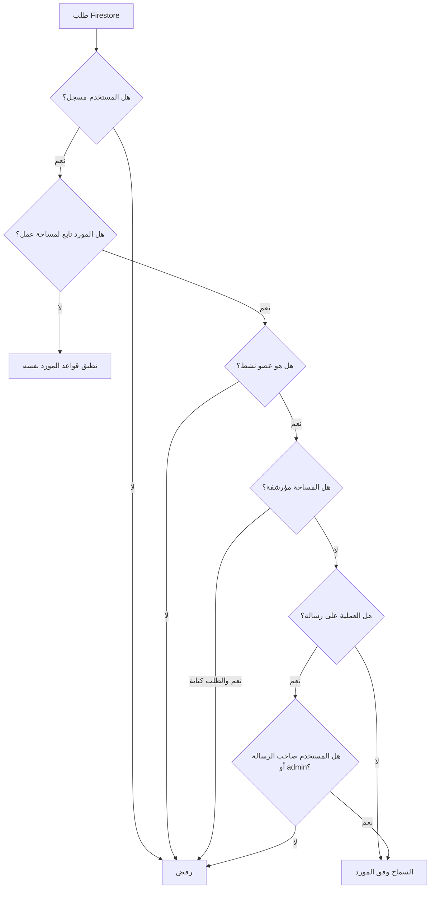

---

## 11. نظام الشات

### الأنواع المدعومة

| النوع | الموقع | الهدف |
|---|---|---|
| `Task Chat` | داخل `TaskDetailPage` | النقاش التنفيذي حول المهمة |
| `Workspace Chat` | تبويب مستقل داخل `WorkspaceDetailPage` | النقاش العام على مستوى الفريق |

### خصائص MVP الحالية

- رسائل نصية فقط.
- منشن `@` لأعضاء الـ workspace.
- حفظ `mentions` داخل الوثيقة.
- soft delete.
- تعديل الرسالة لصاحبها فقط.
- حذف أي رسالة من قبل owner/admin.
- pagination مبدئية بحد `20`.
- real-time عبر streams.
- منع الكتابة إذا كانت المساحة مؤرشفة.

### منطق الإشعارات في الشات

| الحدث | التأثير |
|---|---|
| mention داخل Task Chat | إنشاء إشعار `chat_mention` للمذكور |
| mention داخل Workspace Chat | إنشاء إشعار `chat_mention` للمذكور |
| رسالة جديدة في Task Chat | إشعار خفيف للمنشئ أو المكلّف حسب السياق |

### تسلسل إرسال رسالة مع منشن

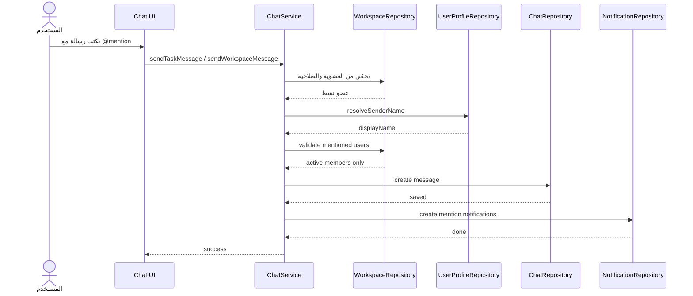

### دورة حياة الرسالة

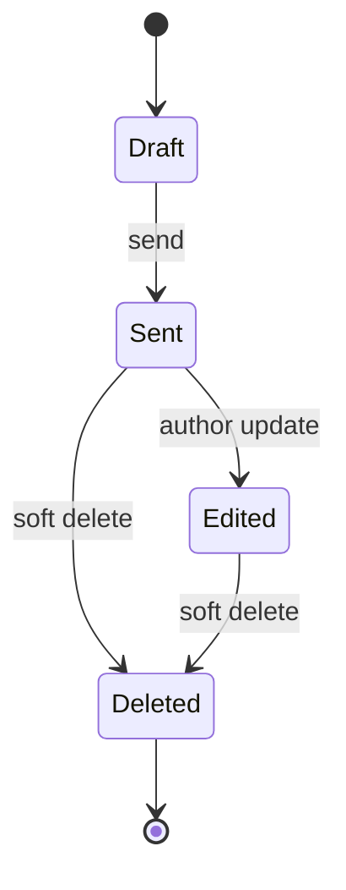

---

## 12. دورة حياة المهمة

منطق حالات المهمة مدمج في `TaskManagementService`.

### قواعد تشغيلية مهمة

- إذا كانت الحالة `blocked` فلابد من `blocked_reason`.
- إذا أصبحت الحالة `in_review` و `review_status == none` يتم رفعها تلقائيًا إلى `pending`.
- إذا أصبحت الحالة `done` يتم:
  - ضبط `progress = 100`
  - تعيين `completed_at = now`
- المكلّف بالمهمة يجب أن يكون عضوًا نشطًا داخل الـ workspace.

### مخطط الحالات

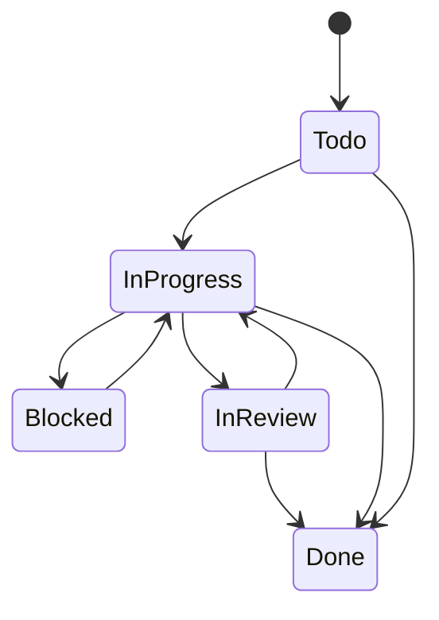

---

## 13. دورة حياة طلب الانضمام

### قواعد تشغيلية

- الطلب يقدم فقط من المستخدم نفسه.
- لا يمكن تقديم طلب إذا كان المستخدم عضوًا نشطًا أصلًا.
- لا يمكن إنشاء عضوية مباشرة من الطرف العميل.
- الـ admin/owner فقط من يوافق أو يرفض.
- عند الموافقة:
  - يتم إنشاء/تحديث `members/{uid}`
  - تحديث `member_ids`
  - تحديث `member_count`
  - زيادة `used_count` في الكود
  - إرسال إشعار بالموافقة

### مخطط الحالات

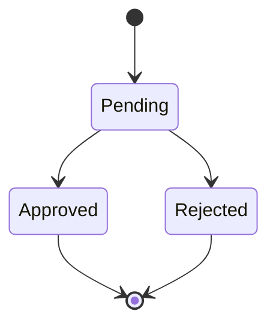

---

## 14. نقاط الربط في الواجهة

| الشاشة | دورها |
|---|---|
| `app/pages/app_shell_page.dart` | بوابة البداية وفق حالة المصادقة |
| `app/pages/home_page.dart` | اختيار التجربة الإدارية أو تجربة العضو |
| `features/workspaces/presentation/pages/workspaces_page.dart` | عرض المساحات وإنشاء/انضمام |
| `features/workspaces/presentation/pages/workspace_detail_page.dart` | تفاصيل المساحة: المشاريع، الفريق، الشات |
| `features/projects/presentation/pages/project_detail_page.dart` | تفاصيل المشروع والمهام |
| `features/tasks/presentation/pages/task_detail_page.dart` | تفاصيل المهمة + `Task Chat` |
| `features/workspace_join/presentation/pages/join_requests_admin_page.dart` | مراجعة الطلبات |
| `features/notifications/presentation/pages/notifications_page.dart` | مركز الإشعارات |

---

## 15. التشغيل المحلي

### المتطلبات

- Flutter SDK مناسب للإصدار الموجود في `pubspec.yaml`
- Firebase CLI
- FlutterFire CLI عند الحاجة لإعادة توليد التهيئة
- مشروع Firebase مفعّل عليه:
  - Authentication
  - Firestore
  - Storage

### خطوات التشغيل

```bash
flutter pub get
flutter analyze
flutter run
```

### إذا كنت تضبط Firebase لأول مرة

1. أنشئ مشروع Firebase.
2. فعّل Email/Password داخل Authentication.
3. أنشئ Firestore database.
4. اربط التطبيق عبر FlutterFire.

مثال عملي:

```bash
dart pub global activate flutterfire_cli
flutterfire configure
firebase deploy --only firestore:rules,firestore:indexes
flutter run
```

### ملف التهيئة المهم

- `lib/firebase_options.dart`

### أوامر مفيدة أثناء التطوير

```bash
flutter analyze
flutter test
firebase deploy --only firestore:rules
firebase deploy --only firestore:indexes
```

---

## 16. الاعتبارات التشغيلية على Firebase Spark

### لماذا لا توجد Cloud Functions؟

لأن المشروع مصمم ليعمل على Spark مع أقل تعقيد ممكن، لذلك تم اعتماد:

- منطق تحقق في `application services`
- منطق أمان في `firestore.rules`
- إشعارات client-side داخل المستودعات/الخدمات

### ما أثر ذلك؟

| القرار | الفائدة | القيد |
|---|---|---|
| عدم استخدام Functions | بساطة ونشر أسرع وتكلفة أقل | بعض العمليات ليست server-authoritative بالكامل |
| `member_ids` كنسخة مكررة | استعلام سريع للمساحات | ضرورة الحفاظ على التزامن مع `members` |
| `join_code_lookup` | حل مباشر للكود بدون query واسع | يتطلب صيانة متزامنة عند تغيير الكود |
| إشعارات client-side | سريعة وسهلة | تعتمد على نجاح العميل في تنفيذ التدفق |

---

## 17. خارطة التوسع المستقبلية

### المسارات الأقرب

- Direct Chat
- Media messages
- Reactions
- Reply threads متقدمة
- Presence / Typing indicator
- Search داخل الشات
- Push notifications حقيقية
- Audit trails أكثر تفصيلًا

### Gantt تقريبي للتوسع

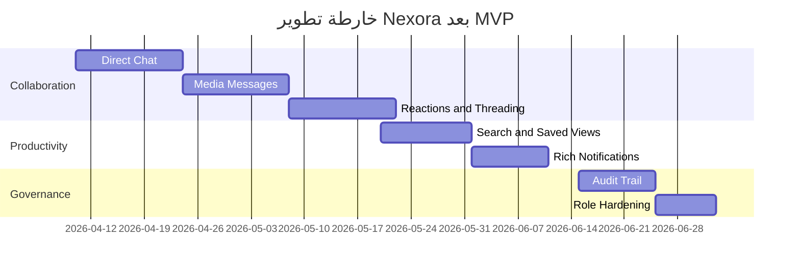

### توزيع نطاق MVP الحالي

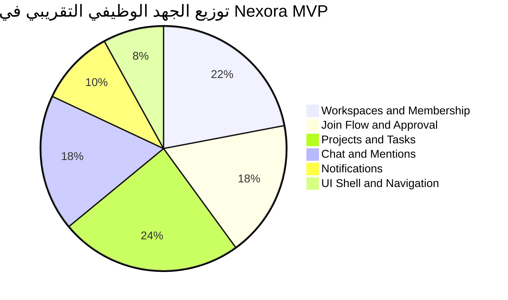

---

## 18. القيود الحالية والديون التقنية المقبولة

| البند | الحالة الحالية | التوصية المستقبلية |
|---|---|---|
| إشعارات الشات | client-side | نقلها إلى server-side عند الترقية |
| تزامن `member_ids` | denormalized | مراقبة قوية أو Cloud Function مستقبلًا |
| Direct Messages | غير موجودة | إنشاء feature مستقلة |
| ملفات الشات | غير مدعومة | إضافة Storage + metadata model |
| إدارة النصوص العربية | موجودة لكن تحتاج تدقيق شامل مستمر | استكمال مراجعة localizations |
| التجارب القديمة في بعض docs | موجودة في `docs/` | تنظيفها أو وسمها كـ archive لاحقًا |

---

## 19. المستندات الداخلية المكملة

| الملف | الاستخدام |
|---|---|
| [README_WORKFLOW_AR.md](./README_WORKFLOW_AR.md) | شرح السيناريوهات وتدفق العمل لكل مستخدم |
| [docs/workspace_join_flow.md](./docs/workspace_join_flow.md) | تفصيل تدفق الانضمام الحالي |
| [firestore.rules](./firestore.rules) | قواعد الأمان الفعلية |
| [firestore.indexes.json](./firestore.indexes.json) | الفهارس الفعلية |

---

## 20. المراجع الرسمية

تمت الاستفادة من المراجع الرسمية التالية عند صياغة التوثيق وربط المفاهيم المعمارية:

- Flutter App Architecture  
  https://docs.flutter.dev/app-architecture
- Firebase Authentication for Flutter  
  https://firebase.google.com/docs/auth/flutter/start
- Cloud Firestore Data Model  
  https://firebase.google.com/docs/firestore/data-model
- Firestore Security Rules Conditions  
  https://firebase.google.com/docs/firestore/security/rules-conditions
- Firestore Indexing  
  https://firebase.google.com/docs/firestore/query-data/indexing

---

## 21. خلاصة هندسية

Nexora في وضعه الحالي ليس مجرد demo، بل قاعدة MVP ناضجة نسبيًا لبناء منصة تعاون فريق خفيفة وواقعية فوق Flutter + Firebase.  
أهم نقاط القوة الحالية:

- هيكل Feature-based واضح.
- مسارات بيانات مفهومة وقابلة للتوسع.
- قواعد أمان جيدة نسبيًا بالنسبة لـ Spark.
- شات سياقي عملي داخل المهمة وعلى مستوى المساحة.
- تدفقات انضمام وموافقة واضحة.

وأهم ما يجب الانتباه له عند التطوير القادم:

- تشديد التزامن بين الوثائق المكررة.
- ترحيل بعض الأحداث الحساسة إلى backend لاحقًا عند التوسع.
- المحافظة على نفس النظافة المعمارية مع زيادة تعقيد التعاون.
