# README Workflow AR

هذا الملف يشرح **كيف يعمل Nexora فعليًا من منظور المستخدمين**، وليس فقط من منظور الكود.  
الهدف هنا هو تحويل المشروع إلى وثيقة تشغيلية واضحة تشرح:

- من هم المستخدمون.
- ماذا يرى كل مستخدم.
- ما هو السيناريو الطبيعي لكل دور.
- كيف تنتقل البيانات والقرارات بين الشاشات والخدمات.
- كيف تبدو دورة العمل اليومية داخل الفريق.

> إذا كنت تبحث عن المعمارية، الجداول، قواعد Firestore، والفهارس، ارجع إلى [README.md](./README.md).

---

## 1. أنواع المستخدمين في Nexora

| المستخدم | الوصف | نقطة البداية | أهم الشاشات |
|---|---|---|---|
| زائر | شخص لم يسجل الدخول بعد | `GuestLandingPage` | التسجيل، تسجيل الدخول، الانضمام عبر كود |
| مستخدم مسجل جديد | يملك حسابًا لكن لم ينضم إلى workspace بعد | `HomePage` أو شاشة الانضمام | Workspaces، Join by Code، Scan QR |
| عضو | عضو نشط داخل workspace | `HomePage` بتجربة العضو | Member Home، My Tasks، Workspace Detail، Task Detail |
| مشرف | Admin داخل workspace | `HomePage` بتجربة الإدارة | Dashboard، Join Requests، Workspace Detail |
| مالك | Owner للمساحة | نفس تجربة المشرف مع صلاحيات أقوى | Dashboard، إدارة المساحة، التحكم الكامل بالعضويات |

---

## 2. الصورة التشغيلية العامة

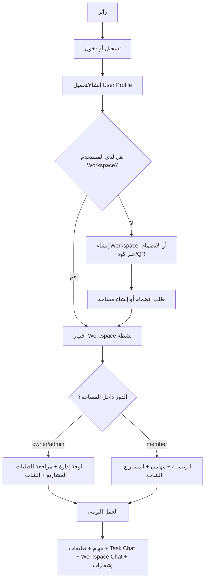

### القراءة السريعة لهذا المخطط

- كل شيء يبدأ من حالة المصادقة.
- بعد المصادقة يتم ضمان وجود ملف المستخدم.
- إذا لم تكن للمستخدم مساحة عمل، فإما أن ينشئ مساحة أو يطلب الانضمام.
- بعد الدخول إلى مساحة العمل، تتغير التجربة حسب الدور.

---

## 3. السيناريو الأساسي رقم 1: الزائر يدخل التطبيق

### الهدف

تحويل الزائر من مستخدم غير معروف إلى مستخدم موثق لديه Profile ويمكنه الانضمام إلى مساحة أو إنشاؤها.

### التدفق

1. يفتح المستخدم التطبيق.
2. `AppShellPage` يتحقق من حالة Firebase Auth.
3. إذا لم يكن هناك مستخدم مسجل، يتم فتح `GuestLandingPage`.
4. يمكنه:
   - إنشاء حساب.
   - تسجيل الدخول.
   - البدء في مسار الانضمام.

### مخطط تسلسل التسجيل

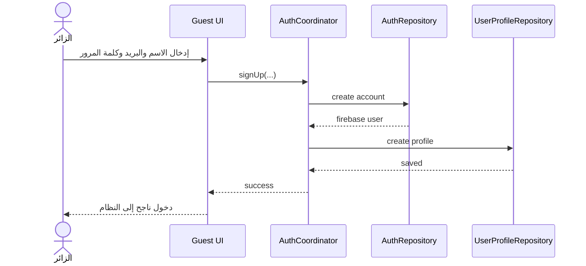

### ماذا يحدث لو فشل التسجيل؟

| الحالة | السلوك |
|---|---|
| البريد مستخدم مسبقًا | تعرض رسالة خطأ واضحة للمستخدم |
| كلمة المرور ضعيفة | يرفض التسجيل |
| فشل إنشاء profile بعد auth | يتم التعامل معها في `ensureProfile` لاحقًا |

---

## 4. السيناريو الأساسي رقم 2: المالك ينشئ مساحة عمل

### الهدف

إنشاء مساحة جديدة بحيث يصبح المستخدم:

- مالكًا `owner`
- عضوًا نشطًا `active`
- أول عنصر داخل `member_ids`

### التدفق

1. المستخدم المسجل يفتح صفحة المساحات.
2. ينشئ Workspace جديدة.
3. تُنشأ وثيقة `workspaces/{workspaceId}`.
4. تُنشأ عضوية `members/{uid}` بدور `owner`.
5. تصبح المساحة متاحة في قائمة المستخدم.

### مخطط الإنشاء

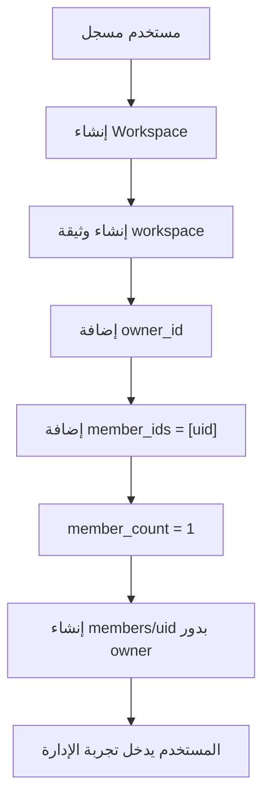

### ملاحظات مهمة

- إنشاء الـ workspace ليس مجرد اسم ووصف، بل Bootstrap كامل للعضوية.
- القواعد الأمنية تتوقع أن من ينشئ المساحة هو نفسه الـ owner الأول.

---

## 5. السيناريو الأساسي رقم 3: المشرف ينشئ كود انضمام ويشاركه

### الهدف

إتاحة دخول أعضاء جدد بطريقة محكومة بدل فتح المساحة مباشرة.

### ما الذي يفعله المشرف؟

1. يفتح لوحة الدعوات أو إدارة الانضمام.
2. ينشئ Join Code.
3. يحدد:
   - نوع الكود: استخدام واحد أو متعدد.
   - تاريخ الانتهاء.
   - الحد الأعلى للاستخدام عند الحاجة.
4. يشارك الكود يدويًا أو على هيئة QR.

### مخطط القرار

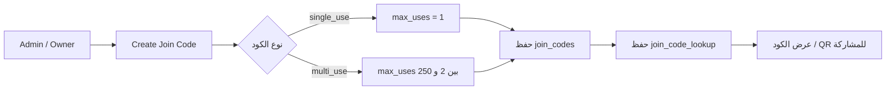

---

## 6. السيناريو الأساسي رقم 4: مستخدم ينضم إلى مساحة عبر كود أو QR

### الهدف

السماح لمستخدم جديد بطلب الانضمام إلى مساحة عمل دون منحه صلاحية فورية.

### التدفق الوظيفي

1. المستخدم يدخل الكود أو يمسح QR.
2. النظام يحل الكود عبر `join_code_lookup/{code_normalized}`.
3. يعرض Preview للمساحة.
4. إذا كان الكود صالحًا:
   - يرسل المستخدم Join Request.
5. الطلب لا يضيفه عضوًا مباشرة.
6. يبقى الطلب `pending` حتى يراجعه admin أو owner.

### مخطط التسلسل

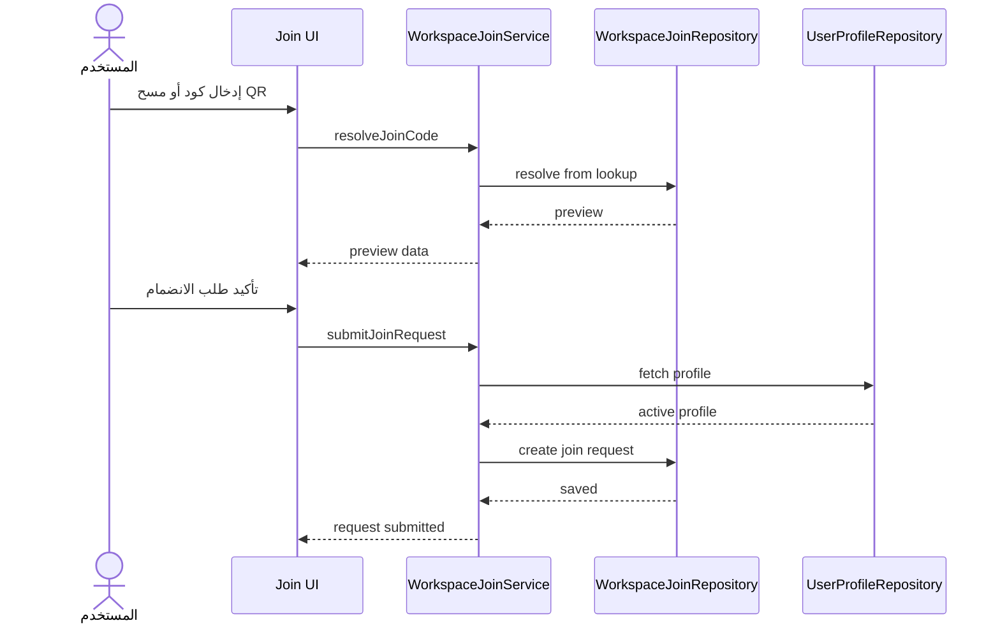

### ماذا يرى المستخدم؟

| الحالة | النتيجة |
|---|---|
| الكود صالح | تظهر بيانات المساحة وإمكانية إرسال الطلب |
| الكود منتهي | يتم رفض المتابعة |
| الكود غير فعال | يتم رفض المتابعة |
| الكود استنفد استخداماته | يتم رفض المتابعة |
| المستخدم عضو بالفعل | لا يسمح بتقديم طلب جديد |

---

## 7. السيناريو الأساسي رقم 5: المشرف يراجع طلب الانضمام

### الهدف

المشرف يقرر من يدخل إلى الفريق بدل الاعتماد على قبول آلي.

### ماذا يحدث عند الموافقة؟

1. تحديث `join_requests/{uid}` إلى `approved`.
2. إنشاء أو تحديث `members/{uid}` بحالة `active`.
3. تحديث `member_ids`.
4. تحديث `member_count`.
5. زيادة `used_count` للكود.
6. إرسال إشعار للمستخدم بالموافقة.

### ماذا يحدث عند الرفض؟

1. تحديث الطلب إلى `rejected`.
2. لا يتم إنشاء عضوية.
3. يرسل إشعار بالرفض.

### مخطط المراجعة

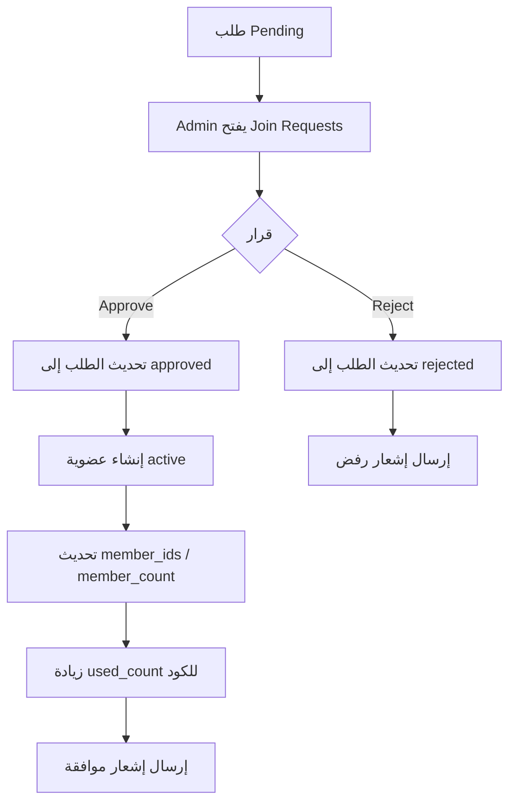

### مخطط حالة العضوية

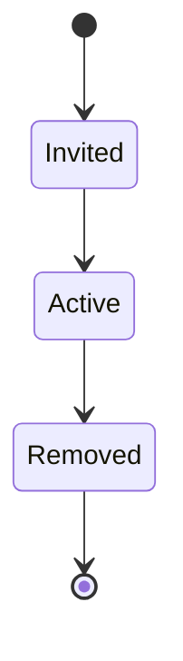

---

## 8. السيناريو الأساسي رقم 6: الفريق يعمل داخل مساحة العمل

### ما الذي يراه العضو؟

- الصفحة الرئيسية الخاصة بالأعضاء.
- شاشة المهام الخاصة به.
- شاشة المساحات.
- الإشعارات.
- الملف الشخصي.

### ما الذي يراه المشرف أو المالك؟

- لوحة Dashboard.
- شاشة المساحات.
- شاشة طلبات الانضمام.
- الإشعارات.
- الملف الشخصي.

### قاعدة التحويل بين التجربتين

`HomePage` يقرأ عضوية المستخدم داخل المساحة المختارة:

- إذا كان `owner` أو `admin` -> تجربة إدارية.
- غير ذلك -> تجربة عضو.

### مخطط التوجيه

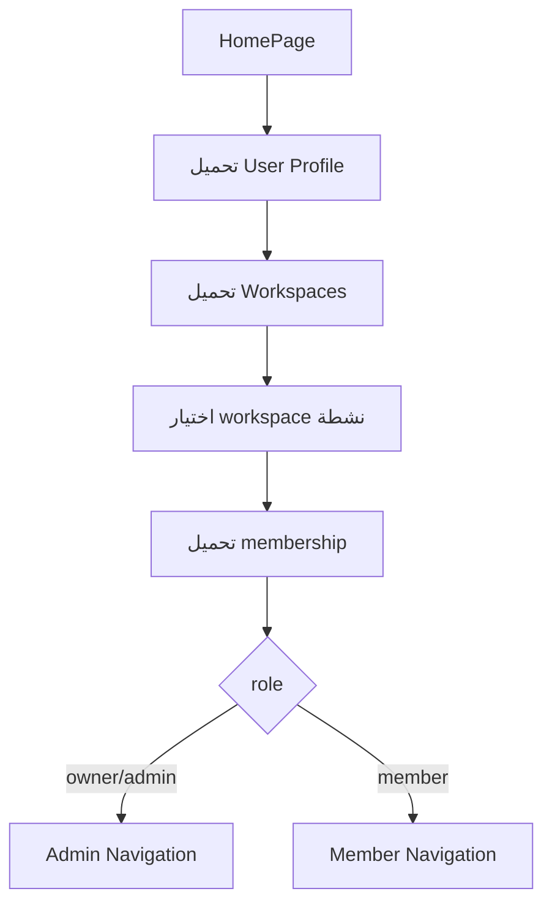

---

## 9. السيناريو الأساسي رقم 7: إدارة المشاريع والمهام

### مسار المشروع

1. داخل مساحة العمل، يفتح المستخدم تفاصيل المساحة.
2. في تبويب المشاريع يتم عرض مشاريع المساحة.
3. يفتح Project Detail.
4. من داخل المشروع يتم عرض المهام المرتبطة.

### مسار المهمة

1. يفتح المستخدم مهمة.
2. يرى:
   - البيانات الأساسية
   - الحالة
   - الأولوية
   - المكلّف
   - التواريخ
   - التقدم
   - المراجعة
   - الشات الخاص بالمهمة

### مخطط دورة تنفيذ المهمة

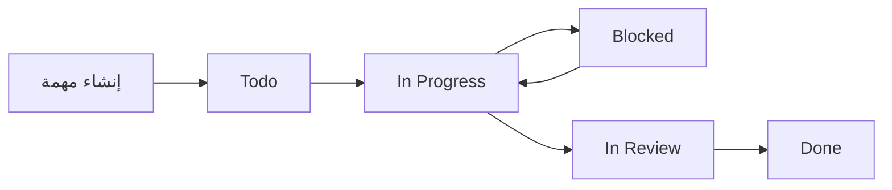

### ماذا يفعل النظام تلقائيًا؟

| الحدث | الاستجابة |
|---|---|
| إسناد المهمة لمستخدم جديد | إشعار `task_assigned` |
| تعديل موعد الاستحقاق | إشعار `task_due_changed` |
| تغيير الحالة | إشعار `task_status_changed` |
| نقل المهمة إلى المراجعة | إشعار `review_required` عند اللزوم |
| إضافة تعليق | إشعار `task_comment_added` للمستهدفين |

---

## 10. السيناريو الأساسي رقم 8: النقاش داخل المهمة Task Chat

### لماذا هذا السيناريو مهم؟

لأن Nexora لا يعامل الشات كصفحة جانبية منفصلة فقط، بل كجزء من تنفيذ المهمة نفسها.  
هذا يعني أن النقاش يبقى مربوطًا بسياقه العملي:

- القرار
- التوضيح
- المتابعة
- الطلب
- الرد على العوائق

### ما الذي يحدث عندما يرسل العضو رسالة؟

1. يفتح `TaskDetailPage`.
2. يكتب الرسالة داخل `Task Chat`.
3. يمكنه استخدام `@` لذكر عضو من أعضاء المساحة.
4. يرسل الرسالة.
5. تُحفظ الرسالة داخل مسار المهمة.
6. تُنشأ إشعارات للمنشن.
7. قد تُنشأ إشعارات خفيفة لأصحاب العلاقة بالمهمة.

### مخطط المهمة والشات

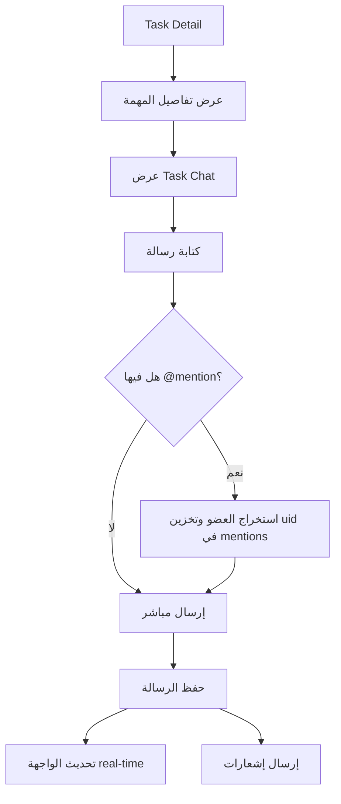

### ما الذي يراه المستخدم في الواجهة؟

- bubbles حديثة
- اسم المرسل
- توقيت خفيف
- حقل إدخال ثابت أسفل الشاشة
- منع الإرسال إذا كان النص فارغًا
- دعم multiline
- رسالة بديلة عند soft delete

### حالات مهمة

| الحالة | السلوك |
|---|---|
| المستخدم ليس عضوًا | لا يرى الشات أو يرفض الوصول |
| المهمة مؤرشفة أو غير موجودة | لا يسمح بالشات |
| الـ workspace مؤرشفة | القراءة ممكنة حسب الشاشة لكن الكتابة تصبح مرفوضة |
| الرسالة فارغة | لا ترسل |
| المستخدم يحاول تعديل رسالة غيره | يرفض |

---

## 11. السيناريو الأساسي رقم 9: الشات الجماعي داخل مساحة العمل Workspace Chat

### الغرض

هذا الشات مخصص للنقاشات العامة التي تخص الفريق كله، مثل:

- تحديثات يومية
- تنسيق داخلي
- تنبيه عام
- طلب مساعدة سريع

### ما الفرق عن Task Chat؟

| البند | Task Chat | Workspace Chat |
|---|---|---|
| النطاق | داخل مهمة واحدة | على مستوى المساحة كاملة |
| الهدف | نقاش تنفيذي مرتبط بمهمة | نقاش عام للفريق |
| المسار | داخل task document | داخل workspace document |
| الإشعارات | mention + task-related | mention فقط بشكل أساسي |

### تسلسل الاستخدام

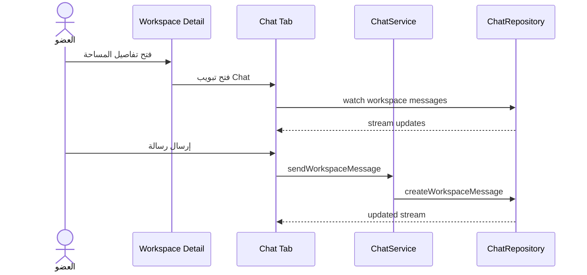

---

## 12. السيناريو الأساسي رقم 10: الإشعارات اليومية

### من أين تأتي الإشعارات؟

الإشعارات تنشأ من منطق العميل داخل الخدمات، وليس من Cloud Functions.

### أنواع الإشعارات الحالية

| النوع | متى ينشأ |
|---|---|
| `task_assigned` | عند إسناد مهمة لمستخدم |
| `task_due_changed` | عند تغيير موعد الاستحقاق |
| `task_status_changed` | عند تغيير حالة المهمة |
| `task_comment_added` | عند إضافة تعليق |
| `task_message_added` | محجوز لاستخدامات الرسائل المرتبطة بالمهام |
| `chat_mention` | عند ذكر المستخدم في الشات |
| `review_required` | عند نقل المهمة إلى المراجعة |
| `member_joined` | متاح للتوسع لاحقًا |
| `join_request_approved` | عند اعتماد الانضمام |
| `join_request_rejected` | عند رفض الانضمام |

### مخطط تدفق الإشعار

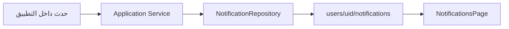

---

## 13. السيناريو الأساسي رقم 11: ماذا يحدث عند أرشفة مساحة العمل؟

### القاعدة التشغيلية

عند أرشفة الـ workspace تصبح المساحة **read-only** على مستوى العمليات الحساسة للكتابة.

### الأثر العملي

| الإجراء | النتيجة عند الأرشفة |
|---|---|
| إرسال رسالة في الشات | مرفوض |
| تعديل رسالة | مرفوض |
| حذف رسالة soft delete | مرفوض |
| إنشاء أو تحديث كيانات قابلة للكتابة | يجب أن يقيد حسب الخدمة/القواعد |
| استعراض البيانات | متوقع أن يبقى ممكنًا حسب الشاشة والقواعد |

### مخطط القرار

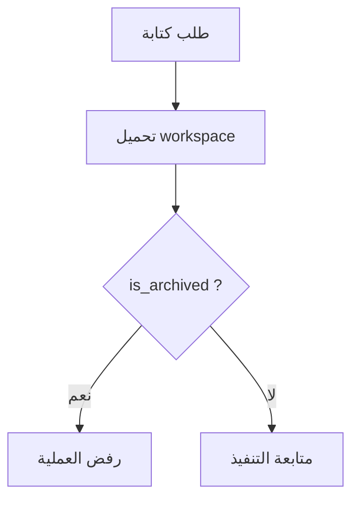

---

## 14. سيناريوهات حسب كل مستخدم

### 14.1 الزائر

هدفه الأساسي:

- إنشاء حساب أو تسجيل الدخول.
- فهم الفكرة العامة للتطبيق.
- بدء الانضمام إلى Workspace إذا كان يملك كودًا.

### 14.2 المستخدم الجديد بعد الدخول

هدفه الأساسي:

- إنشاء مساحة عمل إذا كان سيبدأ فريقًا جديدًا.
- أو تقديم طلب انضمام إلى مساحة قائمة.

### 14.3 العضو

هدفه الأساسي:

- متابعة مهامه.
- فتح المشاريع المرتبطة بعمله.
- استخدام Task Chat للتنسيق الدقيق.
- استخدام Workspace Chat للتواصل العام.
- متابعة الإشعارات.

### 14.4 المشرف

هدفه الأساسي:

- مراقبة المساحة والفريق.
- مراجعة طلبات الانضمام.
- إنشاء أكواد دعوة.
- الإشراف على الشات عند الحاجة.
- إدارة المشاريع على مستوى أعلى.

### 14.5 المالك

هدفه الأساسي:

- كل ما يفعله المشرف.
- بالإضافة إلى السلطة النهائية على المساحة والعضويات.

---

## 15. جدول اليوم التشغيلي النموذجي

| الترتيب | العضو | المشرف/المالك |
|---|---|---|
| 1 | يفتح التطبيق ويراجع المهام | يفتح التطبيق ويراجع Dashboard |
| 2 | يفتح `My Tasks` | يراجع الطلبات الجديدة |
| 3 | يدخل على مهمة محددة | يراجع حالة المشاريع |
| 4 | يحدّث الحالة أو يضيف تعليقًا | ينشئ مشروعًا أو يعدّل مشروعًا |
| 5 | يستخدم Task Chat للتوضيح | يراقب Workspace Chat |
| 6 | يستقبل إشعار mention أو due date | يوافق أو يرفض طلبات الانضمام |
| 7 | ينهي المهمة أو يرسلها للمراجعة | يتدخل عند وجود تعثرات أو رسائل تحتاج إدارة |

### مخطط يوم العمل

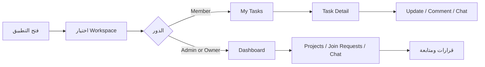

---

## 16. الحالات الحدية Edge Cases

| الحالة | أين تعالج | النتيجة |
|---|---|---|
| المستخدم ليس عضوًا في workspace | Services + Rules + UI guards | لا يرى البيانات أو يرفض الطلب |
| المهمة غير موجودة | Repository / UI | تعرض حالة not found أو يمنع الوصول |
| workspace مؤرشفة | Services + Rules | الكتابة مرفوضة |
| الرسالة فارغة | Validators | الإرسال مرفوض |
| تعديل رسالة شخص آخر | ChatService + Rules | مرفوض |
| join request مكرر | Rules + Repository | مرفوض |
| assigned user ليس عضوًا | TaskManagementService | مرفوض |
| blocked task بدون سبب | TaskManagementService | مرفوض |

---

## 17. ماذا يميز طريقة العمل في Nexora؟

### 1. التعاون مرتبط بالسياق

الشات ليس وحدة معزولة، بل موجود:

- داخل المهمة نفسها
- وداخل مساحة العمل نفسها

وهذا يقلل فقدان السياق ويجعل الرجوع إلى القرار أسهل.

### 2. الانضمام مضبوط وليس فوضويًا

حتى مع Spark وبدون Cloud Functions، التطبيق يفرض احتكاكًا إداريًا كافيًا لحماية البيانات:

- كود
- QR
- Request
- Approval

### 3. التوسع ممكن بدون إعادة بناء كاملة

بسبب فصل الطبقات والكيانات، يمكن إضافة:

- Direct Chat
- Media
- Reactions
- Threading

بدون نسف النظام الحالي.

---

## 18. توصيات تشغيلية للفريق التقني

| التوصية | السبب |
|---|---|
| نشر `firestore.rules` و `firestore.indexes.json` مع كل تغيير هيكلي | حتى لا تتعطل الشاشات بسبب permissions أو index errors |
| الحفاظ على `member_ids` متزامنة مع `members` | لأنها تدخل في الوصول والاستعلامات |
| مراجعة النصوص العربية دوريًا | لأن بعض الملفات القديمة قد تحتوي على تشوهات ترميز |
| إضافة اختبارات على الخدمات قبل التوسع | خاصة `TaskManagementService`, `ChatService`, `WorkspaceJoinService` |
| مراقبة أي منطق client-side حساس | لتحديد ما يجب نقله لاحقًا إلى backend |

---

## 19. الخلاصة التشغيلية

إذا أردت وصف Nexora بجملة تشغيلية واحدة:

> **منصة عمل فريق تبدأ بالعضوية، تتحرك عبر المشاريع والمهام، وتُدار يوميًا من خلال نقاش سياقي وإشعارات موجهة.**

المشروع الحالي جاهز ليخدم فريقًا صغيرًا إلى متوسطًا ضمن حدود MVP محترم، مع أساس جيد جدًا للتوسع لاحقًا.
